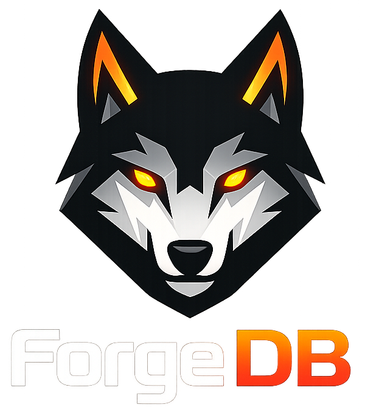
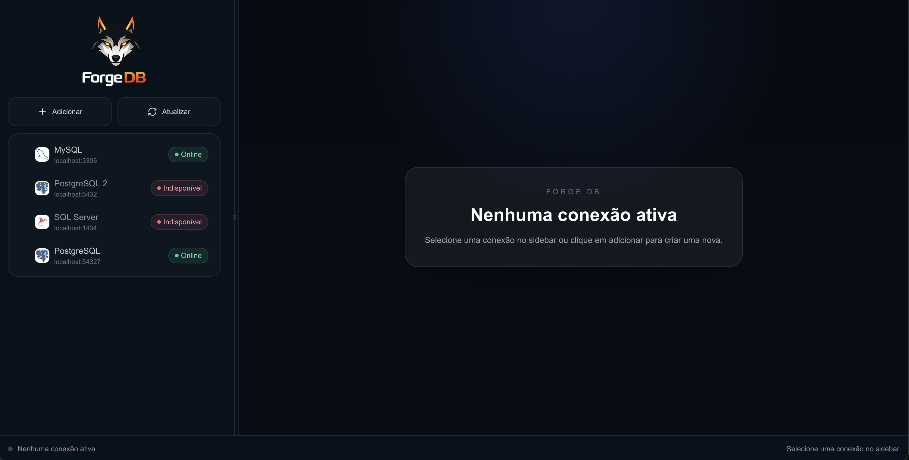
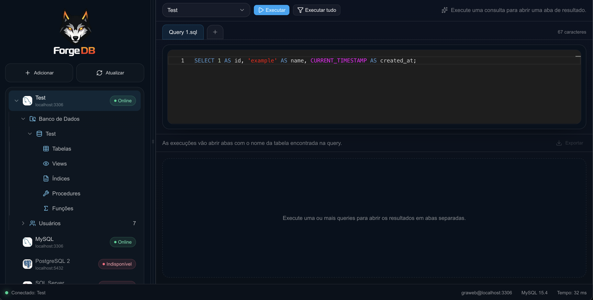
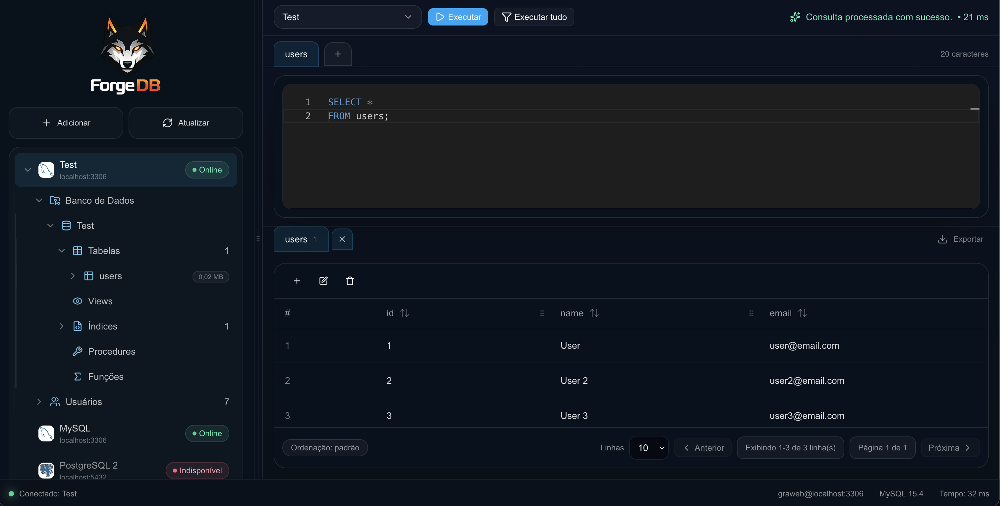
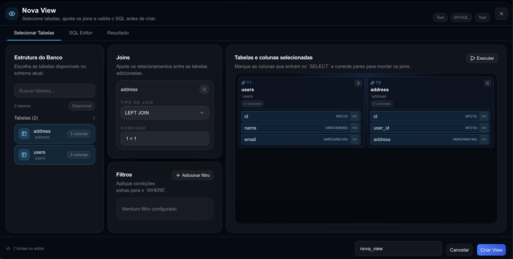
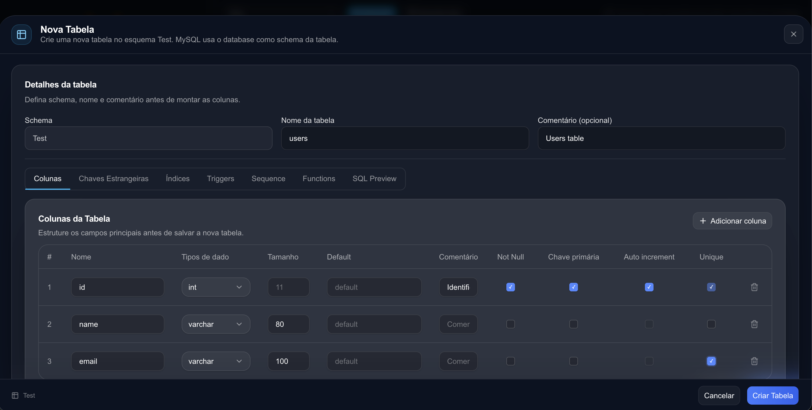

# Forge DB

Forge DB é uma interface web para gerenciar conexões e explorar bancos de dados em um fluxo visual, com editor SQL integrado, tree view de objetos, criação de tabelas, views, rotinas e execução de consultas. 

<p align="center">
  
</p>

## Visão Geral

O sistema foi pensado para centralizar tarefas comuns de administração e consulta de bancos em uma experiência próxima de um workspace de desenvolvimento: menu lateral com conexões e objetos do banco, editor SQL com abas, resultados em tabela e modais específicos para criar ou editar estruturas.

### Tela Inicial



Área inicial com estilo de prompt, atalhos para conexão e indicação de status do ambiente.

### Conexões e Tree View



O menu lateral lista as conexões salvas e organiza os objetos do banco por tipo, respeitando a estrutura de cada engine.

### Editor SQL e Resultado da Consulta



O editor usa Monaco Editor, suporta múltiplas abas, autocomplete para objetos do banco e execução de consultas.
Os resultados são exibidos em uma tabela responsiva com paginação, ordenação e redimensionamento de colunas.

### Criação de View



O modal de view permite selecionar tabelas, identificar relações, ajustar joins, editar SQL e validar o resultado antes da criação.

### Criação de Tabela



Procedures e funções usam uma modal única, adaptada ao banco conectado e ao tipo de rotina escolhido.

## Bancos Suportados

- MySQL
- MariaDB
- PostgreSQL
- SQL Server
- SQLite

Cada banco é exibido conforme sua estrutura. MySQL e MariaDB organizam objetos diretamente por banco. PostgreSQL e SQL Server exibem bancos, schemas e objetos internos quando aplicável.

## Tree View

- Listagem de bancos, schemas, tabelas, views, procedures, funções, índices e sequences.
- Menus de contexto por objeto.
- Atualização localizada de grupos do tree view após criação, edição ou exclusão.
- Duplo clique em tabelas e views para abrir ou selecionar a aba SQL correspondente e executar a consulta.

## Editor SQL

- Editor Monaco com sintaxe SQL.
- Múltiplas abas de consulta.
- Aba de resultado vinculada à consulta executada.
- Autocomplete para tabelas, views, procedures, funções e colunas.
- Execução de SQL no banco selecionado.
- Query padrão quando não há consulta aberta.

## Resultados

- Tabela responsiva para exibição dos dados retornados.
- Ordenação por coluna.
- Paginação.
- Redimensionamento de colunas.
- Exportação de resultados para Excel.
- Ações de adicionar, editar e remover exibidas apenas em consultas diretas de tabela.

## Tabelas

- Criação e edição de tabelas.
- Edição de colunas, tipos, tamanhos, PK, unique, identity/auto increment e foreign keys.
- Tratamento específico por banco para tipos de dados e auto incremento.
- Remoção de tabela com atualização dos grupos relacionados no tree view.
- No PostgreSQL, sequences associadas a colunas auto increment podem ser criadas e removidas junto da tabela.

## Views

- Criação e edição de views.
- Seleção visual de tabelas e colunas.
- Identificação automática de foreign keys entre tabelas selecionadas.
- Configuração de joins.
- Aba SQL Editor com Monaco.
- Aba Resultado sempre disponível para pré-visualizar a consulta.
- Validação para impedir criar view com nome já existente.

## Procedures, Funções e Sequences

- Criação, edição, execução e exclusão de procedures e funções.
- Modal única para rotina, com campos dinâmicos por banco e tipo.
- Atualização localizada das listas de procedures e funções.
- Criação de sequences no PostgreSQL.
- Menu de contexto para criar e atualizar sequences.

## Tecnologias

- Next.js
- React
- TypeScript
- Tailwind CSS
- Monaco Editor
- Radix UI
- MySQL2
- MariaDB
- PostgreSQL `pg`
- Microsoft SQL Server `mssql`
- Better SQLite3
- XLSX

## Como Rodar

Instale as dependências:

```bash
npm install
```

Inicie o ambiente de desenvolvimento:

```bash
npm run dev
```

Acesse:

```text
http://localhost:3000
```

## Scripts Disponíveis

```bash
npm run dev
npm run lint
npm run build
npm run start
```

## Estrutura Principal

```text
app/
  api/                 Rotas da API para conexões, bancos, tabelas, views e rotinas
  dashboard/           Página do dashboard por conexão
components/
  connections/         Modal e componentes de conexão
  dashboard/           Shell, sidebar, editor, resultados e modais do sistema
  ui/                  Componentes reutilizáveis de interface
helpers/
  create-table/        Geração de SQL por banco
  metadata/            Leitura de metadados por engine
lib/
  connections.ts       Operações principais com os bancos
types/
  *.ts                 Tipos compartilhados do domínio
public/
  logos/               Logos dos bancos suportados
docs/
  images/              Imagens usadas neste README
```
